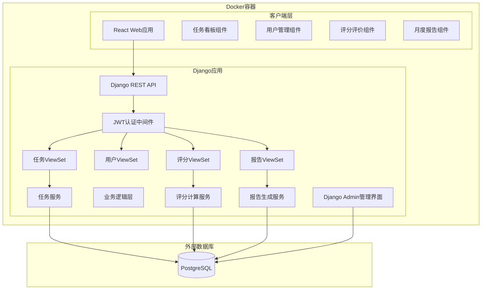

# 设计文档

## 概述

团队OKR任务看板和绩效得分系统是一个基于Web的全栈应用，采用前后端分离架构。系统核心功能包括任务看板管理、智能绩效评分、部门协作和月度报告生成。设计重点在于构建灵活的评分算法、直观的拖拽交互和全面的数据分析能力。

技术栈：
- 前端：React + TypeScript + Tailwind CSS + React DnD（拖拽库）
- 后端：Python + Django + Django REST Framework
- 管理界面：Django Admin + django-admin-interface（美观的UI框架）
- API文档：Swagger/OpenAPI (drf-yasg)
- 数据库：PostgreSQL
  - 主机：121.43.104.161:6432
  - 数据库名：OKR
  - 用户名：OKR
  - 密码：123OKR
- 认证：Django JWT (djangorestframework-simplejwt)
- 部署：Docker + Docker Compose

## 架构

### 系统架构图



### 分层职责

1. **客户端层**：负责用户界面渲染、交互处理和状态管理
2. **API层**：提供RESTful接口、请求验证和认证授权
3. **业务逻辑层**：实现核心业务规则、评分算法和数据处理
4. **数据层**：持久化存储和数据查询

## 组件和接口

### 核心组件

#### 1. 用户管理组件 (UserManagement)

**职责**：
- 管理员注册和管理团队成员
- 用户认证和授权
- 部门分配和成员信息维护

**接口**：
```python
# Django REST Framework ViewSet
class UserViewSet(viewsets.ModelViewSet):
    def register_member(self, request) -> User:
        """管理员注册新团队成员"""
        pass
    
    def authenticate(self, request) -> dict:
        """用户认证，返回JWT令牌"""
        pass
    
    def update(self, request, pk) -> User:
        """更新成员信息"""
        pass
    
    def list_by_department(self, request) -> List[User]:
        """按部门查询成员"""
        pass
    
    def list(self, request) -> List[User]:
        """获取所有成员"""
        pass
```

#### 2. 任务管理组件 (TaskManagement)

**职责**：
- 创建和编辑任务
- 管理任务状态转换
- 分配负责人和协作者
- 计算任务分值分配

**接口**：
```python
# Django REST Framework ViewSet
class TaskViewSet(viewsets.ModelViewSet):
    def create(self, request) -> Task:
        """创建新任务"""
        pass
    
    def update_status(self, request, pk) -> Task:
        """更新任务状态"""
        pass
    
    def assign_members(self, request, pk) -> Task:
        """分配负责人和协作者"""
        pass
    
    def list_by_status(self, request) -> List[Task]:
        """按状态查询任务"""
        pass
    
    def list_by_member(self, request) -> List[Task]:
        """查询成员的任务"""
        pass

# 业务逻辑服务
class TaskService:
    @staticmethod
    def calculate_score_distribution(task: Task) -> ScoreDistribution:
        """计算任务分值分配"""
        pass
```

#### 3. 评分计算组件 (ScoringEngine)

**职责**：
- 实现绩效分值算法
- 计算任务评分调整
- 标准化各维度得分
- 生成个人和部门排名

**接口**：
```python
# 业务逻辑服务
class ScoringService:
    @staticmethod
    def calculate_personal_score(user_id: str, month: date) -> PerformanceScore:
        """计算个人绩效分值"""
        pass
    
    @staticmethod
    def calculate_department_score(department: str, month: date) -> float:
        """计算部门OKR分值"""
        pass
    
    @staticmethod
    def normalize_work_hours(hours: float) -> float:
        """标准化工作小时"""
        pass
    
    @staticmethod
    def normalize_completion_rate(rate: float) -> float:
        """标准化完成任务比例"""
        pass
    
    @staticmethod
    def calculate_task_rating_adjustment(task_id: str) -> float:
        """计算任务评分调整系数"""
        pass
    
    @staticmethod
    def rank_members(month: date) -> List[MemberRanking]:
        """生成成员排名"""
        pass
```

#### 4. 评价系统组件 (ReviewSystem)

**职责**：
- 收集任务评分和评论
- 管理月度互评
- 支持匿名评价
- 聚合评价数据

**接口**：
```python
# Django REST Framework ViewSet
class ReviewViewSet(viewsets.ModelViewSet):
    def submit_task_review(self, request) -> Review:
        """提交任务评价"""
        pass
    
    def submit_monthly_review(self, request) -> Review:
        """提交月度互评"""
        pass
    
    def list_task_reviews(self, request, task_id) -> List[Review]:
        """获取任务的所有评价"""
        pass
    
    def list_monthly_reviews(self, request) -> List[Review]:
        """获取用户的月度评价"""
        pass

# 业务逻辑服务
class ReviewService:
    @staticmethod
    def calculate_average_rating(task_id: str) -> float:
        """计算任务平均评分"""
        pass
```

#### 5. 报告生成组件 (ReportGenerator)

**职责**：
- 生成月度报告
- 汇总统计数据
- 归档历史数据
- 提供数据可视化

**接口**：
```python
# Django REST Framework ViewSet
class ReportViewSet(viewsets.ViewSet):
    def generate_monthly_report(self, request) -> MonthlyReport:
        """生成月度报告"""
        pass
    
    def get_personal_report(self, request, user_id) -> PersonalReport:
        """获取个人报告"""
        pass
    
    def get_department_report(self, request, department) -> DepartmentReport:
        """获取部门报告"""
        pass
    
    def export_report(self, request, report_id) -> HttpResponse:
        """导出报告（PDF或Excel）"""
        pass

# 业务逻辑服务
class ReportService:
    @staticmethod
    def archive_previous_month(month: date) -> None:
        """归档上月数据"""
        pass
```

## 数据模型

### 用户模型 (User)

```python
from django.contrib.auth.models import AbstractUser
from django.db import models

class Department(models.TextChoices):
    HARDWARE = 'hardware', '硬件部门'
    SOFTWARE = 'software', '软件部门'
    MARKETING = 'marketing', '市场部门'

class User(AbstractUser):
    """团队成员模型"""
    id = models.UUIDField(primary_key=True, default=uuid.uuid4, editable=False)
    name = models.CharField(max_length=100, verbose_name='姓名')
    email = models.EmailField(unique=True, verbose_name='邮箱')
    department = models.CharField(
        max_length=20, 
        choices=Department.choices,
        verbose_name='部门'
    )
    role = models.CharField(
        max_length=10,
        choices=[('admin', '管理员'), ('member', '成员')],
        default='member',
        verbose_name='角色'
    )
    is_active = models.BooleanField(default=True, verbose_name='是否激活')
    created_at = models.DateTimeField(auto_now_add=True, verbose_name='创建时间')
    updated_at = models.DateTimeField(auto_now=True, verbose_name='更新时间')
    
    class Meta:
        db_table = 'users'
        verbose_name = '用户'
        verbose_name_plural = '用户'
```

### 任务模型 (Task)

```python
class TaskStatus(models.TextChoices):
    TODO = 'todo', '未完成'
    IN_PROGRESS = 'in_progress', '进行中'
    COMPLETED = 'completed', '完成'
    POSTPONED = 'postponed', '推迟'

class Task(models.Model):
    """任务模型"""
    id = models.UUIDField(primary_key=True, default=uuid.uuid4, editable=False)
    title = models.CharField(max_length=200, verbose_name='任务标题')
    description = models.TextField(verbose_name='任务描述')
    difficulty_score = models.IntegerField(
        validators=[MinValueValidator(1), MaxValueValidator(10)],
        verbose_name='难度分值'
    )
    revenue_amount = models.DecimalField(
        max_digits=12,
        decimal_places=2,
        default=0,
        validators=[MinValueValidator(0)],
        verbose_name='变现金额'
    )
    status = models.CharField(
        max_length=20,
        choices=TaskStatus.choices,
        default=TaskStatus.TODO,
        verbose_name='状态'
    )
    owner = models.ForeignKey(
        User, 
        on_delete=models.CASCADE,
        related_name='owned_tasks',
        verbose_name='负责人'
    )
    collaborators = models.ManyToManyField(
        User,
        related_name='collaborated_tasks',
        blank=True,
        verbose_name='协作者'
    )
    created_by = models.ForeignKey(
        User,
        on_delete=models.SET_NULL,
        null=True,
        related_name='created_tasks',
        verbose_name='创建者'
    )
    created_at = models.DateTimeField(auto_now_add=True, verbose_name='创建时间')
    started_at = models.DateTimeField(null=True, blank=True, verbose_name='开始时间')
    completed_at = models.DateTimeField(null=True, blank=True, verbose_name='完成时间')
    postponed_at = models.DateTimeField(null=True, blank=True, verbose_name='推迟时间')
    postpone_reason = models.TextField(blank=True, verbose_name='推迟原因')
    
    class Meta:
        db_table = 'tasks'
        verbose_name = '任务'
        verbose_name_plural = '任务'
        indexes = [
            models.Index(fields=['status']),
            models.Index(fields=['owner']),
            models.Index(fields=['completed_at']),
        ]
```

### 分值分配模型 (ScoreDistribution)

```python
class ScoreDistribution(models.Model):
    """分值分配模型"""
    id = models.UUIDField(primary_key=True, default=uuid.uuid4, editable=False)
    task = models.OneToOneField(
        Task,
        on_delete=models.CASCADE,
        related_name='score_distribution',
        verbose_name='任务'
    )
    total_score = models.DecimalField(
        max_digits=5, 
        decimal_places=2,
        verbose_name='总分值'
    )
    calculated_at = models.DateTimeField(auto_now_add=True, verbose_name='计算时间')
    
    class Meta:
        db_table = 'score_distributions'
        verbose_name = '分值分配'
        verbose_name_plural = '分值分配'

class ScoreAllocation(models.Model):
    """个人分值分配明细"""
    id = models.UUIDField(primary_key=True, default=uuid.uuid4, editable=False)
    distribution = models.ForeignKey(
        ScoreDistribution,
        on_delete=models.CASCADE,
        related_name='allocations',
        verbose_name='分值分配'
    )
    user = models.ForeignKey(
        User,
        on_delete=models.CASCADE,
        verbose_name='用户'
    )
    base_score = models.DecimalField(
        max_digits=5,
        decimal_places=2,
        verbose_name='基础分值'
    )
    adjusted_score = models.DecimalField(
        max_digits=5,
        decimal_places=2,
        verbose_name='调整后分值'
    )
    percentage = models.DecimalField(
        max_digits=5,
        decimal_places=2,
        verbose_name='分配比例'
    )
    
    class Meta:
        db_table = 'score_allocations'
        verbose_name = '分值分配明细'
        verbose_name_plural = '分值分配明细'
```

### 评价模型 (Review)

```python
class ReviewType(models.TextChoices):
    TASK = 'task', '任务评价'
    MONTHLY = 'monthly', '月度评价'

class Review(models.Model):
    """评价模型"""
    id = models.UUIDField(primary_key=True, default=uuid.uuid4, editable=False)
    type = models.CharField(
        max_length=10,
        choices=ReviewType.choices,
        verbose_name='评价类型'
    )
    task = models.ForeignKey(
        Task,
        on_delete=models.CASCADE,
        null=True,
        blank=True,
        related_name='reviews',
        verbose_name='任务'
    )
    reviewee = models.ForeignKey(
        User,
        on_delete=models.CASCADE,
        null=True,
        blank=True,
        related_name='received_reviews',
        verbose_name='被评价人'
    )
    reviewer = models.ForeignKey(
        User,
        on_delete=models.CASCADE,
        related_name='given_reviews',
        verbose_name='评价人'
    )
    rating = models.IntegerField(
        validators=[MinValueValidator(1), MaxValueValidator(10)],
        verbose_name='评分'
    )
    comment = models.TextField(verbose_name='评论')
    is_anonymous = models.BooleanField(default=False, verbose_name='是否匿名')
    month = models.DateField(null=True, blank=True, verbose_name='月份')
    created_at = models.DateTimeField(auto_now_add=True, verbose_name='创建时间')
    
    class Meta:
        db_table = 'reviews'
        verbose_name = '评价'
        verbose_name_plural = '评价'
        indexes = [
            models.Index(fields=['type', 'task']),
            models.Index(fields=['month']),
        ]
```

### 绩效分值模型 (PerformanceScore)

```python
class PerformanceScore(models.Model):
    """绩效分值模型"""
    id = models.UUIDField(primary_key=True, default=uuid.uuid4, editable=False)
    user = models.ForeignKey(
        User,
        on_delete=models.CASCADE,
        related_name='performance_scores',
        verbose_name='用户'
    )
    month = models.DateField(verbose_name='月份')
    
    # 基础维度
    work_hours = models.DecimalField(
        max_digits=6,
        decimal_places=2,
        verbose_name='工作小时'
    )
    work_hours_score = models.DecimalField(
        max_digits=4,
        decimal_places=2,
        verbose_name='工作小时分'
    )
    completion_rate = models.DecimalField(
        max_digits=5,
        decimal_places=2,
        verbose_name='完成任务比例'
    )
    completion_rate_score = models.DecimalField(
        max_digits=4,
        decimal_places=2,
        verbose_name='完成任务比例分'
    )
    avg_difficulty_score = models.DecimalField(
        max_digits=4,
        decimal_places=2,
        verbose_name='难度平均分'
    )
    total_revenue = models.DecimalField(
        max_digits=12,
        decimal_places=2,
        verbose_name='变现金额总和'
    )
    revenue_score = models.DecimalField(
        max_digits=4,
        decimal_places=2,
        verbose_name='变现金额分'
    )
    department_avg_score = models.DecimalField(
        max_digits=4,
        decimal_places=2,
        verbose_name='部门平均分'
    )
    
    # 任务评分
    task_rating_score = models.DecimalField(
        max_digits=4,
        decimal_places=2,
        verbose_name='任务评分'
    )
    
    # 月度评价维度
    culture_understanding_score = models.DecimalField(
        max_digits=4,
        decimal_places=2,
        verbose_name='企业文化理解分'
    )
    team_fit_score = models.DecimalField(
        max_digits=4,
        decimal_places=2,
        verbose_name='团队契合度分'
    )
    monthly_growth_score = models.DecimalField(
        max_digits=4,
        decimal_places=2,
        verbose_name='本月成长分'
    )
    biggest_contribution_score = models.DecimalField(
        max_digits=4,
        decimal_places=2,
        verbose_name='本月最大贡献分'
    )
    peer_evaluation_score = models.DecimalField(
        max_digits=4,
        decimal_places=2,
        verbose_name='他人评价分'
    )
    admin_final_score = models.DecimalField(
        max_digits=4,
        decimal_places=2,
        null=True,
        blank=True,
        verbose_name='管理员最终评分'
    )
    
    # 最终分值
    final_score = models.DecimalField(
        max_digits=5,
        decimal_places=2,
        verbose_name='最终分值'
    )
    rank = models.IntegerField(verbose_name='排名')
    calculated_at = models.DateTimeField(auto_now_add=True, verbose_name='计算时间')
    
    class Meta:
        db_table = 'performance_scores'
        verbose_name = '绩效分值'
        verbose_name_plural = '绩效分值'
        unique_together = [['user', 'month']]
        indexes = [
            models.Index(fields=['month', 'final_score']),
        ]
```

### 月度报告模型 (MonthlyReport)

```python
class MonthlyReport(models.Model):
    """月度报告模型"""
    id = models.UUIDField(primary_key=True, default=uuid.uuid4, editable=False)
    month = models.DateField(unique=True, verbose_name='月份')
    generated_at = models.DateTimeField(auto_now_add=True, verbose_name='生成时间')
    
    class Meta:
        db_table = 'monthly_reports'
        verbose_name = '月度报告'
        verbose_name_plural = '月度报告'

class DepartmentReport(models.Model):
    """部门报告模型"""
    id = models.UUIDField(primary_key=True, default=uuid.uuid4, editable=False)
    monthly_report = models.ForeignKey(
        MonthlyReport,
        on_delete=models.CASCADE,
        related_name='department_reports',
        verbose_name='月度报告'
    )
    department = models.CharField(
        max_length=20,
        choices=Department.choices,
        verbose_name='部门'
    )
    total_okr_score = models.DecimalField(
        max_digits=10,
        decimal_places=2,
        verbose_name='部门OKR总分'
    )
    member_count = models.IntegerField(verbose_name='成员数量')
    avg_score = models.DecimalField(
        max_digits=5,
        decimal_places=2,
        verbose_name='平均分'
    )
    completed_tasks = models.IntegerField(verbose_name='完成任务数')
    avg_difficulty = models.DecimalField(
        max_digits=4,
        decimal_places=2,
        verbose_name='平均难度'
    )
    
    class Meta:
        db_table = 'department_reports'
        verbose_name = '部门报告'
        verbose_name_plural = '部门报告'

class WorkHours(models.Model):
    """工作小时记录"""
    id = models.UUIDField(primary_key=True, default=uuid.uuid4, editable=False)
    user = models.ForeignKey(
        User,
        on_delete=models.CASCADE,
        related_name='work_hours',
        verbose_name='用户'
    )
    month = models.DateField(verbose_name='月份')
    hours = models.DecimalField(
        max_digits=6,
        decimal_places=2,
        verbose_name='工作小时'
    )
    recorded_by = models.ForeignKey(
        User,
        on_delete=models.SET_NULL,
        null=True,
        related_name='recorded_work_hours',
        verbose_name='记录人'
    )
    created_at = models.DateTimeField(auto_now_add=True, verbose_name='创建时间')
    
    class Meta:
        db_table = 'work_hours'
        verbose_name = '工作小时'
        verbose_name_plural = '工作小时'
        unique_together = [['user', 'month']]

class MonthlyEvaluation(models.Model):
    """月度综合评价模型"""
    id = models.UUIDField(primary_key=True, default=uuid.uuid4, editable=False)
    user = models.ForeignKey(
        User,
        on_delete=models.CASCADE,
        related_name='monthly_evaluations',
        verbose_name='被评价人'
    )
    month = models.DateField(verbose_name='月份')
    
    # 自我评价维度
    culture_understanding_score = models.IntegerField(
        validators=[MinValueValidator(1), MaxValueValidator(10)],
        verbose_name='企业文化理解分值'
    )
    culture_understanding_text = models.TextField(verbose_name='企业文化理解文字')
    culture_understanding_option = models.CharField(
        max_length=100,
        verbose_name='企业文化理解选项'
    )
    
    team_fit_option = models.CharField(
        max_length=100,
        verbose_name='团队契合度选项'
    )
    team_fit_text = models.TextField(verbose_name='团队契合度文字')
    team_fit_ranking = models.JSONField(
        verbose_name='团队契合度-其他员工排名',
        help_text='存储用户对其他员工的排名列表'
    )
    
    monthly_growth_score = models.IntegerField(
        validators=[MinValueValidator(1), MaxValueValidator(10)],
        verbose_name='本月成长分值'
    )
    monthly_growth_text = models.TextField(verbose_name='本月成长文字')
    monthly_growth_option = models.CharField(
        max_length=100,
        verbose_name='本月成长选项'
    )
    
    biggest_contribution_score = models.IntegerField(
        validators=[MinValueValidator(1), MaxValueValidator(10)],
        verbose_name='本月最大贡献分值'
    )
    biggest_contribution_text = models.TextField(verbose_name='本月最大贡献文字')
    biggest_contribution_option = models.CharField(
        max_length=100,
        verbose_name='本月最大贡献选项'
    )
    
    # 管理员最终评价
    admin_final_score = models.IntegerField(
        null=True,
        blank=True,
        validators=[MinValueValidator(1), MaxValueValidator(10)],
        verbose_name='管理员最终评分'
    )
    admin_final_comment = models.TextField(
        blank=True,
        verbose_name='管理员最终评价'
    )
    admin_evaluated_by = models.ForeignKey(
        User,
        on_delete=models.SET_NULL,
        null=True,
        blank=True,
        related_name='admin_evaluations',
        verbose_name='评价管理员'
    )
    admin_evaluated_at = models.DateTimeField(
        null=True,
        blank=True,
        verbose_name='管理员评价时间'
    )
    
    created_at = models.DateTimeField(auto_now_add=True, verbose_name='创建时间')
    updated_at = models.DateTimeField(auto_now=True, verbose_name='更新时间')
    
    class Meta:
        db_table = 'monthly_evaluations'
        verbose_name = '月度综合评价'
        verbose_name_plural = '月度综合评价'
        unique_together = [['user', 'month']]

class PeerEvaluation(models.Model):
    """他人评价模型"""
    id = models.UUIDField(primary_key=True, default=uuid.uuid4, editable=False)
    monthly_evaluation = models.ForeignKey(
        MonthlyEvaluation,
        on_delete=models.CASCADE,
        related_name='peer_evaluations',
        verbose_name='月度评价'
    )
    evaluator = models.ForeignKey(
        User,
        on_delete=models.CASCADE,
        related_name='given_peer_evaluations',
        verbose_name='评价人'
    )
    score = models.IntegerField(
        validators=[MinValueValidator(1), MaxValueValidator(10)],
        verbose_name='评分'
    )
    ranking = models.IntegerField(
        verbose_name='排名',
        help_text='评价人给被评价人的排名'
    )
    comment = models.TextField(verbose_name='评价文字')
    is_anonymous = models.BooleanField(default=False, verbose_name='是否匿名')
    created_at = models.DateTimeField(auto_now_add=True, verbose_name='创建时间')
    
    class Meta:
        db_table = 'peer_evaluations'
        verbose_name = '他人评价'
        verbose_name_plural = '他人评价'
        unique_together = [['monthly_evaluation', 'evaluator']]
```


## 正确性属性

*属性是一个特征或行为，应该在系统的所有有效执行中保持为真——本质上是关于系统应该做什么的正式陈述。属性作为人类可读规范和机器可验证正确性保证之间的桥梁。*

### 属性 1: 用户创建完整性
*对于任何*有效的用户注册数据（包含姓名、邮箱、密码和部门），创建用户后返回的用户对象应该包含所有输入字段以及系统生成的唯一ID
**验证需求: 1.1, 1.3**

### 属性 2: 用户ID唯一性
*对于任何*批量创建的用户集合，所有生成的用户ID应该是唯一的，不存在重复
**验证需求: 1.3**

### 属性 3: 认证往返一致性
*对于任何*有效的用户账户，使用正确的邮箱和密码进行认证应该返回有效的访问令牌，使用该令牌应该能够识别出原始用户
**验证需求: 2.1**

### 属性 4: 任务可见性权限
*对于任何*用户和任务集合，用户查询到的任务列表应该只包含该用户作为负责人或协作者的任务
**验证需求: 2.2**

### 属性 5: 任务状态分组正确性
*对于任何*任务集合，按状态分组后，每个分组中的所有任务状态应该与分组键一致，且所有任务都应该出现在某个分组中
**验证需求: 2.3**

### 属性 6: 无效凭证拒绝
*对于任何*无效的登录凭证（错误的邮箱或密码），认证尝试应该失败并返回错误信息
**验证需求: 2.5**

### 属性 7: 任务难度分值范围
*对于任何*任务创建请求，如果难度分值在1到10之间，应该成功创建；如果超出范围，应该拒绝并返回验证错误
**验证需求: 3.2**

### 属性 8: 任务初始状态
*对于任何*新创建的任务，其初始状态应该为"未完成"(TODO)
**验证需求: 3.5**

### 属性 9: 状态转换时间戳
*对于任何*任务，当状态从"未完成"转换到"进行中"时应该记录开始时间，转换到"完成"时应该记录完成时间
**验证需求: 4.1, 4.2**

### 属性 10: 推迟状态需要原因
*对于任何*任务，将状态更新为"推迟"时必须提供推迟原因，否则更新应该失败
**验证需求: 4.3**

### 属性 11: 任务修改权限
*对于任何*任务和用户，只有当用户是该任务的负责人或协作者之一时，才能修改任务状态
**验证需求: 4.5**

### 属性 12: 分值分配总和守恒
*对于任何*已完成的任务，分配给所有参与者（负责人和协作者）的基础分值总和应该等于任务的难度分值
**验证需求: 5.1, 5.2, 5.3**

### 属性 13: 负责人分值比例
*对于任何*有协作者的任务，负责人获得的分值应该是难度分值的50%；对于没有协作者的任务，负责人应该获得100%
**验证需求: 5.1, 5.3**

### 属性 14: 协作者分值平均分配
*对于任何*有多个协作者的任务，每个协作者获得的分值应该相等，且总和为难度分值的50%
**验证需求: 5.2**

### 属性 15: 分值精度
*对于任何*分值计算结果，应该保留两位小数精度
**验证需求: 5.4**

### 属性 16: 累积分值单调递增
*对于任何*用户，完成新任务后的累积分值应该大于或等于完成前的累积分值
**验证需求: 5.5**

### 属性 17: 评分权限和范围
*对于任何*已完成的任务，其他团队成员（非任务参与者）应该能够提交1到10之间的评分；超出范围的评分应该被拒绝
**验证需求: 6.1, 6.2**

### 属性 18: 匿名评价身份隐藏
*对于任何*标记为匿名的评价，普通成员查询时不应该看到评价者身份，但管理员应该能够看到
**验证需求: 6.3, 9.4**

### 属性 19: 任务评分调整系数
*对于任何*已完成的任务，最终分值调整系数应该等于（所有评分的平均值 / 10）× 0.3 + 0.7，确保评分占30%权重
**验证需求: 6.5**

### 属性 20: 绩效分值维度完整性
*对于任何*用户的月度绩效计算，结果应该包含工作小时分、完成任务比例分、难度平均分、他人评分和部门平均分五个维度的标准化分数
**验证需求: 7.1**

### 属性 21: 完成任务比例计算
*对于任何*用户，完成任务比例应该等于已完成任务数除以分配给该用户的总任务数
**验证需求: 7.3**

### 属性 22: 难度平均分计算
*对于任何*用户，难度平均分应该等于该用户完成的所有任务的难度分值的算术平均值
**验证需求: 7.4**

### 属性 23: 部门平均分计算
*对于任何*部门，部门平均分应该等于部门总OKR分值除以部门成员数量
**验证需求: 7.5**

### 属性 24: 绩效分值加权公式
*对于任何*用户的月度绩效，最终分值应该等于：工作小时分×10% + 完成任务比例分×15% + 难度平均分×10% + 变现金额分×10% + 部门平均分×5% + 任务评分×10% + 企业文化理解×5% + 团队契合度×3% + 本月成长×3% + 本月最大贡献×4% + 他人评价×5% + 管理员最终评分×15%
**验证需求: 10.1, 10.2, 10.3**

### 属性 25: 标准化函数范围
*对于任何*维度的标准化函数，输出结果应该在0到10的范围内
**验证需求: 10.3, 10.4, 10.6, 10.7**

### 属性 26: 工作小时标准化
*对于任何*工作小时数，标准化分数应该等于 min(工作小时 / 300 × 10, 10)，其中300小时为满分基准
**验证需求: 10.5**

### 属性 27: 完成率标准化
*对于任何*完成任务比例（0到1之间），标准化分数应该等于完成率 × 10
**验证需求: 10.4**

### 属性 28: 最终分值范围和精度
*对于任何*计算出的最终绩效分值，应该在0到100之间，并保留两位小数
**验证需求: 10.9**

### 属性 29: 排名排序正确性
*对于任何*月度报告中的成员排名，成员应该按照最终绩效分值从高到低排序，分值相同时按用户ID排序保证稳定性
**验证需求: 8.2**

### 属性 30: 月度评价对象过滤
*对于任何*用户进行月度互评时，可选择的评价对象列表应该包含所有其他团队成员，但不包含用户自己
**验证需求: 9.2**

### 属性 31: 评价必需字段
*对于任何*提交的评价（任务评价或月度评价），必须包含评分（1-10）和文字评论，否则应该拒绝提交
**验证需求: 9.3**

### 属性 32: 自我评价完整性
*对于任何*月度自我评价，必须包含企业文化理解（分值、文字、选项）、团队契合度（选项、文字、排名）、本月成长（分值、文字、选项）、本月最大贡献（分值、文字、选项）所有字段
**验证需求: 9.1**

### 属性 33: 团队契合度排名唯一性
*对于任何*团队契合度排名列表，应该包含除提交者外的所有团队成员，且每个成员只出现一次
**验证需求: 9.4**

### 属性 34: 他人评价完整性
*对于任何*他人评价，必须包含评分（1-10）、排名和文字评论
**验证需求: 9.2**

### 属性 35: 管理员最终评价权限
*对于任何*管理员最终评价，只有管理员角色的用户才能提交，且提交后应该触发绩效分值重新计算
**验证需求: 11.2, 11.3**

### 属性 36: 推迟任务惩罚
*对于任何*状态为"推迟"的任务，其分值应该应用惩罚系数（小于1），使得最终分配的分值低于原始难度分值
**验证需求: 10.4**

### 属性 37: 变现金额非负性
*对于任何*任务，变现金额字段应该是非负数，负数应该被拒绝
**验证需求: 3.3**

### 属性 38: 变现金额累积计算
*对于任何*用户，月度变现金额总和应该等于该用户在当月完成的所有任务的变现金额之和
**验证需求: 10.9**

### 属性 39: 变现金额标准化范围
*对于任何*变现金额标准化分数，输出结果应该在0到10的范围内
**验证需求: 10.9**

## 错误处理

### 错误类型定义

```python
from rest_framework.exceptions import APIException
from rest_framework import status

class ErrorCode:
    """错误代码常量"""
    # 认证错误
    INVALID_CREDENTIALS = 'INVALID_CREDENTIALS'
    UNAUTHORIZED = 'UNAUTHORIZED'
    TOKEN_EXPIRED = 'TOKEN_EXPIRED'
    
    # 验证错误
    INVALID_INPUT = 'INVALID_INPUT'
    MISSING_REQUIRED_FIELD = 'MISSING_REQUIRED_FIELD'
    INVALID_RANGE = 'INVALID_RANGE'
    
    # 业务逻辑错误
    TASK_NOT_FOUND = 'TASK_NOT_FOUND'
    USER_NOT_FOUND = 'USER_NOT_FOUND'
    PERMISSION_DENIED = 'PERMISSION_DENIED'
    INVALID_STATUS_TRANSITION = 'INVALID_STATUS_TRANSITION'
    DUPLICATE_REVIEW = 'DUPLICATE_REVIEW'
    
    # 系统错误
    DATABASE_ERROR = 'DATABASE_ERROR'
    INTERNAL_ERROR = 'INTERNAL_ERROR'

class AppException(APIException):
    """自定义应用异常"""
    def __init__(self, code, message, details=None, status_code=status.HTTP_400_BAD_REQUEST):
        self.code = code
        self.message = message
        self.details = details
        self.status_code = status_code
        super().__init__(detail={
            'code': code,
            'message': message,
            'details': details,
            'timestamp': timezone.now()
        })
```

### 错误处理策略

1. **输入验证错误**：在API层立即返回400状态码和详细错误信息
2. **认证授权错误**：返回401或403状态码，不泄露敏感信息
3. **业务逻辑错误**：返回422状态码和业务相关的错误描述
4. **数据库错误**：记录详细日志，向客户端返回通用错误信息
5. **未预期错误**：捕获所有异常，返回500状态码，记录完整堆栈

### 关键场景错误处理

- **任务状态转换失败**：回滚状态，通知用户，记录失败原因
- **分值计算异常**：使用事务确保数据一致性，失败时不更新任何分值
- **评分提交冲突**：检测重复评分，允许更新但记录修改历史
- **月度报告生成失败**：保留上次成功的报告，标记当前月份为待生成状态

## 测试策略

### 基础测试

**测试框架**：Django内置测试框架

**覆盖范围**：
- 核心业务逻辑（评分计算、分值分配）
- API端点基本功能
- 数据模型验证

**重点测试场景**：
- 任务创建和状态转换
- 分值计算正确性
- 用户认证和权限
- 月度评价提交

## 实现注意事项

### 数据库设计

1. **索引策略**：
   - 用户表：email（唯一索引）
   - 任务表：status、owner、completed_at
   - 评价表：month
   - 复合索引：(user, month) 用于绩效查询

2. **事务处理**：
   - 分值分配使用事务确保原子性
   - 月度报告生成使用事务

### Django Admin配置

1. **使用django-admin-interface美化界面**：
   - 提供现代化的管理界面
   - 支持主题定制
   - 更好的用户体验

2. **管理功能**：
   - 用户管理（注册、编辑、删除）
   - 任务管理（创建、查看、修改状态）
   - 工作小时录入
   - 月度报告查看和管理员评价
   - 评价数据查看

### 前端状态管理

1. **全局状态**：
   - 当前用户信息和权限
   - 任务列表和过滤状态

2. **本地状态**：
   - 表单输入状态
   - UI交互状态（拖拽、模态框）

### 认证和权限

1. **认证**：
   - JWT令牌认证
   - 密码使用Django默认加密

2. **权限控制**：
   - 管理员：完整权限
   - 普通成员：查看团队任务、提交评价、查看自己的报告

## Docker部署

### Docker Compose配置

```yaml
version: '3.8'

services:
  web:
    build: .
    command: python manage.py runserver 0.0.0.0:8000
    volumes:
      - .:/app
    ports:
      - "8000:8000"
    environment:
      - DB_HOST=121.43.104.161
      - DB_PORT=6432
      - DB_NAME=OKR
      - DB_USER=OKR
      - DB_PASSWORD=123OKR
    depends_on:
      - db

  frontend:
    build: ./frontend
    ports:
      - "3000:3000"
    volumes:
      - ./frontend:/app
    environment:
      - REACT_APP_API_URL=http://localhost:8000
```

### Dockerfile示例

```dockerfile
FROM python:3.11-slim

WORKDIR /app

COPY requirements.txt .
RUN pip install --no-cache-dir -r requirements.txt

COPY . .

RUN python manage.py collectstatic --noinput

EXPOSE 8000

CMD ["gunicorn", "config.wsgi:application", "--bind", "0.0.0.0:8000"]
```

### 环境配置

1. **开发环境**：
   - Docker Compose启动
   - 热重载开发服务器
   - Django Debug Toolbar

2. **生产环境**：
   - Docker容器部署
   - Gunicorn WSGI服务器
   - Nginx反向代理（可选）
